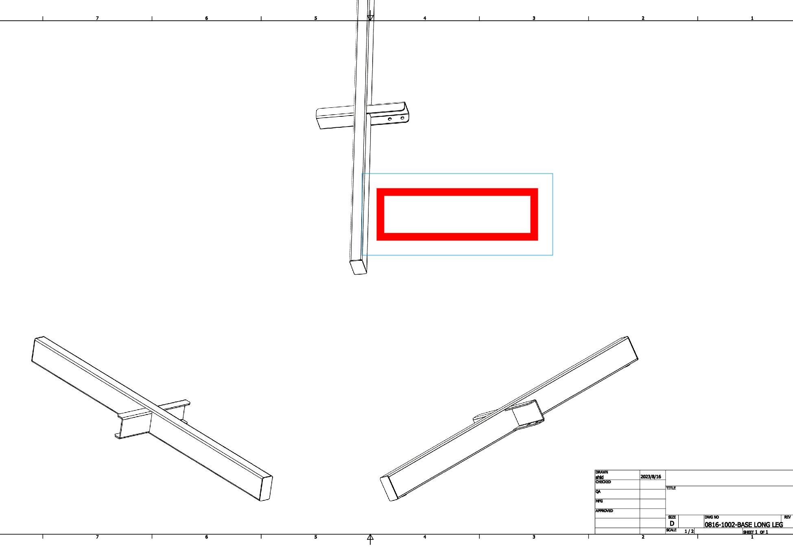

- rect
  - 
  - getWidth: 1584.0
  - getHeight: 2448.0
```json
{
  "id": "25e65016-18b3-40c9-8422-ba47e55386a8",
  "title": "rect",
  "is2d": true,
  "sheetGUID": "3c9663fa-f808-5c8f-bb86-ca8423d7b731",
  "sheetName": "Sheet",
  "markups": [
    {
      "type": "rectangle",
      "state": {
        "anchors": [
          {
            "x": 0.5312077352518472,
            "y": 9.497643121914173,
            "z": 0
          },
          {
            "x": 13.984413579814586,
            "y": 9.497643121914173,
            "z": 0
          },
          {
            "x": 13.984413579814586,
            "y": 1.0114315286668067,
            "z": 0
          },
          {
            "x": 0.5312077352518472,
            "y": 1.011431528672576,
            "z": -0.000006997537756060298
          }
        ],
        "style": {
          "stroke-color": "#FF0000",
          "font-size": 36,
          "font-weight": "normal",
          "font-family": "Artifakt Element, Arial",
          "font-style": "normal",
          "font-color": "#FF0000",
          "stroke-width": 0.39370078740157477,
          "fill-opacity": 0.5,
          "fill-color": "-1",
          "stroke-opacity": 1
        },
        "translation": {
          "x": 0,
          "y": 0,
          "z": 0
        },
        "rotation": 0,
        "scale": {
          "x": 1,
          "y": 1,
          "z": 1
        }
      },
      "dataModelVersion": 6
    }
  ],
  "CreatedByUserName": "pancras lu",
  "CreatedByUserId": 590
}
```
---
## line
```json
{
  "id": "25e65016-18b3-40c9-8422-ba47e55386a8",
  "title": "rect",
  "is2d": true,
  "sheetGUID": "3c9663fa-f808-5c8f-bb86-ca8423d7b731",
  "sheetName": "Sheet",
  "markups": [
    {
      "type": "line",
      "state": {
        "anchors": [
          {
            "x": -0.010943483884158667,
            "y": 0.0889592884272119,
            "z": 0
          },
          {
            "x": 33.81540543857514,
            "y": 21.816833971798278,
            "z": 0
          }
        ],
        "style": {
          "stroke-color": "#FF0000",
          "font-size": 36,
          "font-weight": "normal",
          "font-family": "Artifakt Element, Arial",
          "font-style": "normal",
          "font-color": "#FF0000",
          "stroke-width": 0.39370078740157477,
          "fill-opacity": 0.5,
          "fill-color": "-1",
          "stroke-opacity": 1
        },
        "translation": {
          "x": 0,
          "y": 0,
          "z": 0
        },
        "rotation": 0,
        "scale": {
          "x": 1,
          "y": 1,
          "z": 1
        }
      },
      "dataModelVersion": 6
    }
  ],
  "CreatedByUserName": "pancras lu",
  "CreatedByUserId": 590
}
```

---

## DWG text
```json
{
  "id": "ece89432-cdd0-4ffe-83ba-a6a7cafeccea",
  "title": "text",
  "is2d": true,
  "sheetGUID": "3c9663fa-f808-5c8f-bb86-ca8423d7b731",
  "sheetName": "Sheet",
  "markups": [
    {
      "type": "callout",
      "state": {
        "text": "Default Text",
        "isFrameUsed": true,
        "frameType": "rectangle",
        "anchors": [
          {
            "x": 11.164084631456529,
            "y": 14.640270253684394,
            "z": -1.6231837338257393e-7
          },
          {
            "x": 13.40599189304883,
            "y": 14.640270253684394,
            "z": -1.6231837338257393e-7
          },
          {
            "x": 13.40599189304883,
            "y": 15.033971041085834,
            "z": 1.6231837338257393e-7
          },
          {
            "x": 11.164084631456529,
            "y": 15.033971041085834,
            "z": 1.6231837338257393e-7
          }
        ],
        "style": {
          "stroke-color": "#FF0000",
          "font-size": 70,
          "font-weight": "normal",
          "font-family": "Artifakt Element, Arial",
          "font-style": "normal",
          "font-color": "#FF0000",
          "stroke-width": 0.15748031496062992,
          "fill-opacity": 0.5,
          "fill-color": "-1",
          "stroke-opacity": 1
        },
        "translation": {
          "x": 0.1859142607174103,
          "y": -0.7545931758530182,
          "z": 0
        },
        "rotation": 0,
        "scale": {
          "x": 1,
          "y": 1,
          "z": 1
        }
      },
      "frameState": {
        "anchors": [
          {
            "x": 10.88849408268725,
            "y": 12.855493333119169,
            "z": 0
          },
          {
            "x": 14.053410968076577,
            "y": 12.855493333119169,
            "z": 0
          },
          {
            "x": 14.053410968076577,
            "y": 15.309561574588985,
            "z": 0
          },
          {
            "x": 10.88849408268725,
            "y": 15.309561574588985,
            "z": 0
          }
        ],
        "style": {
          "stroke-color": "#FF0000",
          "font-size": 36,
          "font-weight": "normal",
          "font-family": "Artifakt Element, Arial",
          "font-style": "normal",
          "font-color": "#FF0000",
          "stroke-width": 0.15748031496062992,
          "fill-opacity": 0.5,
          "fill-color": "-1",
          "stroke-opacity": 1
        },
        "translation": {
          "x": 0,
          "y": 0,
          "z": 0
        },
        "rotation": 0,
        "scale": {
          "x": 1,
          "y": 1,
          "z": 1
        }
      },
      "dataModelVersion": 6
    }
  ],
  "CreatedByUserName": "pancras lu",
  "CreatedByUserId": 590
}
```

---
## dwgComplexText
```json
{
  "id": "",
  "title": "complex text",
  "is2d": true,
  "sheetGUID": "3c9663fa-f808-5c8f-bb86-ca8423d7b731",
  "sheetName": "Sheet",
  "markups": [
    {
      "type": "callout",
      "state": {
        "text": "WebGL Renderer: ANGLE (NVIDIA, NVIDIA T1000 (0x00001FB0) Direct3D11 vs_5_0 ps_5_0, D3D11)",
        "isFrameUsed": true,
        "frameType": "rectangle",
        "anchors": [
          {
            "x": 10.400884514837244,
            "y": 13.549983881008078,
            "z": -1.6231837338257393e-7
          },
          {
            "x": 12.642791776429545,
            "y": 13.549983881008078,
            "z": -1.6231837338257393e-7
          },
          {
            "x": 12.642791776429545,
            "y": 13.943684668409519,
            "z": 1.6231837338257393e-7
          },
          {
            "x": 10.400884514837244,
            "y": 13.943684668409519,
            "z": 1.6231837338257393e-7
          }
        ],
        "style": {
          "stroke-color": "#FF0000",
          "font-size": 70,
          "font-weight": "normal",
          "font-family": "Artifakt Element, Arial",
          "font-style": "normal",
          "font-color": "#FF0000",
          "stroke-width": 0.39370078740157477,
          "fill-opacity": 0.5,
          "fill-color": "-1",
          "stroke-opacity": 1
        },
        "translation": {
          "x": 14.08184287361523,
          "y": 2.71473707700819,
          "z": 0
        },
        "rotation": 0,
        "scale": {
          "x": 3.2162073518462453,
          "y": 1,
          "z": 1
        }
      },
      "frameState": {
        "anchors": [
          {
            "x": 21.41884630794789,
            "y": 13.585368476975766,
            "z": 0
          },
          {
            "x": 29.7885148282896,
            "y": 13.585368476975766,
            "z": 0
          },
          {
            "x": 29.7885148282896,
            "y": 19.33777442623211,
            "z": 0
          },
          {
            "x": 21.41884630794789,
            "y": 19.33777442623211,
            "z": 0
          }
        ],
        "style": {
          "stroke-color": "#FF0000",
          "font-size": 36,
          "font-weight": "normal",
          "font-family": "Artifakt Element, Arial",
          "font-style": "normal",
          "font-color": "#FF0000",
          "stroke-width": 0.39370078740157477,
          "fill-opacity": 0.5,
          "fill-color": "-1",
          "stroke-opacity": 1
        },
        "translation": {
          "x": 0,
          "y": 0,
          "z": 0
        },
        "rotation": 0,
        "scale": {
          "x": 1,
          "y": 1,
          "z": 1
        }
      },
      "dataModelVersion": 6
    }
  ],
  "CreatedByUserName": "pancras lu",
  "CreatedByUserId": 590
}
```


---
## dwgManyLineText
```json
{"id":"85fb6aae-676f-494d-9f06-52f41434a593","title":"many line text","is2d":true,"sheetGUID":"3c9663fa-f808-5c8f-bb86-ca8423d7b731","sheetName":"Sheet","markups":[{"type":"callout","state":{"text":"Default Text","isFrameUsed":true,"frameType":"rectangle","anchors":[{"x":12.70352193642178,"y":11.651802520187248,"z":-1.878838953947568e-7},{"x":14.94542919801408,"y":11.651802520187248,"z":-1.878838953947568e-7},{"x":14.94542919801408,"y":12.045503307588643,"z":1.878838953947568e-7},{"x":12.70352193642178,"y":12.045503307588643,"z":1.878838953947568e-7}],"style":{"stroke-color":"#FF0000","font-size":48,"font-weight":"normal","font-family":"Artifakt Element, Arial","font-style":"normal","font-color":"#FF0000","stroke-width":0.39370078740157477,"fill-opacity":0.5,"fill-color":"-1","stroke-opacity":1},"translation":{"x":9.789398118160758,"y":6.395349431803262,"z":0},"rotation":0,"scale":{"x":1.7132009386121028,"y":1,"z":1}},"frameState":{"anchors":[{"x":21.234137376117314,"y":17.522217639548536,"z":0},{"x":25.993610145037298,"y":17.522217639548536,"z":0},{"x":25.993610145037298,"y":18.96578719335431,"z":0},{"x":21.234137376117314,"y":18.96578719335431,"z":0}],"style":{"stroke-color":"#FF0000","font-size":36,"font-weight":"normal","font-family":"Artifakt Element, Arial","font-style":"normal","font-color":"#FF0000","stroke-width":0.39370078740157477,"fill-opacity":0.5,"fill-color":"-1","stroke-opacity":1},"translation":{"x":0,"y":0,"z":0},"rotation":0,"scale":{"x":1,"y":1,"z":1}},"dataModelVersion":6},{"type":"callout","state":{"text":"Deprecated API usage.","isFrameUsed":true,"frameType":"rectangle","anchors":[{"x":20.024125435488415,"y":15.829342109290039,"z":-2.505118605263424e-7},{"x":23.009689739950357,"y":15.829342109290039,"z":-2.505118605263424e-7},{"x":23.009689739950357,"y":16.3542764924919,"z":2.505118605263424e-7},{"x":20.024125435488415,"y":16.3542764924919,"z":2.505118605263424e-7}],"style":{"stroke-color":"#FF0000","font-size":48,"font-weight":"normal","font-family":"Artifakt Element, Arial","font-style":"normal","font-color":"#FF0000","stroke-width":0.39370078740157477,"fill-opacity":0.5,"fill-color":"-1","stroke-opacity":1},"translation":{"x":2.115723939578054,"y":-0.7729849675140881,"z":0},"rotation":0,"scale":{"x":1.3009294357617265,"y":1,"z":1}},"frameState":{"anchors":[{"x":21.231309620603472,"y":14.334572350850166,"z":0},{"x":26.033953251521087,"y":14.334572350850166,"z":0},{"x":26.033953251521087,"y":16.303076287858037,"z":0},{"x":21.231309620603472,"y":16.303076287858037,"z":0}],"style":{"stroke-color":"#FF0000","font-size":48,"font-weight":"normal","font-family":"Artifakt Element, Arial","font-style":"normal","font-color":"#FF0000","stroke-width":0.39370078740157477,"fill-opacity":0.5,"fill-color":"-1","stroke-opacity":1},"translation":{"x":0,"y":0,"z":0},"rotation":0,"scale":{"x":1,"y":1,"z":1}},"dataModelVersion":6},{"type":"callout","state":{"text":"Net GPU geom memory used: 1145602","isFrameUsed":true,"frameType":"rectangle","anchors":[{"x":21.064383146445905,"y":11.776624815169878,"z":-2.505118605263424e-7},{"x":24.049947450907847,"y":11.776624815169878,"z":-2.505118605263424e-7},{"x":24.049947450907847,"y":12.30155919837174,"z":2.505118605263424e-7},{"x":21.064383146445905,"y":12.30155919837174,"z":2.505118605263424e-7}],"style":{"stroke-color":"#FF0000","font-size":48,"font-weight":"normal","font-family":"Artifakt Element, Arial","font-style":"normal","font-color":"#FF0000","stroke-width":0.39370078740157477,"fill-opacity":0.5,"fill-color":"-1","stroke-opacity":1},"translation":{"x":1.0617267113389017,"y":-0.21900161997434964,"z":0},"rotation":0,"scale":{"x":1.3077959701366784,"y":1,"z":1}},"frameState":{"anchors":[{"x":21.20731987301353,"y":10.573371225657901,"z":0},{"x":26.03046410301759,"y":10.573371225657901,"z":0},{"x":26.03046410301759,"y":13.066809545867876,"z":0},{"x":21.20731987301353,"y":13.066809545867876,"z":0}],"style":{"stroke-color":"#FF0000","font-size":48,"font-weight":"normal","font-family":"Artifakt Element, Arial","font-style":"normal","font-color":"#FF0000","stroke-width":0.39370078740157477,"fill-opacity":0.5,"fill-color":"-1","stroke-opacity":1},"translation":{"x":0,"y":0,"z":0},"rotation":0,"scale":{"x":1,"y":1,"z":1}},"dataModelVersion":6},{"type":"callout","state":{"text":"Deprecated API usage: No \"GlobalWorker\" specified.","isFrameUsed":true,"frameType":"rectangle","anchors":[{"x":20.872756726006372,"y":8.382099705567459,"z":-2.505118605263424e-7},{"x":23.858321030468314,"y":8.382099705567459,"z":-2.505118605263424e-7},{"x":23.858321030468314,"y":8.90703408876932,"z":2.505118605263424e-7},{"x":20.872756726006372,"y":8.90703408876932,"z":2.505118605263424e-7}],"style":{"stroke-color":"#FF0000","font-size":48,"font-weight":"normal","font-family":"Artifakt Element, Arial","font-style":"normal","font-color":"#FF0000","stroke-width":0.39370078740157477,"fill-opacity":0.5,"fill-color":"-1","stroke-opacity":1},"translation":{"x":7.4075672904502525,"y":8.91303118058786,"z":0},"rotation":0,"scale":{"x":1.304308219348344,"y":1,"z":1}},"frameState":{"anchors":[{"x":27.36674082780121,"y":16.04841212352632,"z":0},{"x":32.17947193080971,"y":16.04841212352632,"z":0},{"x":32.17947193080971,"y":19.066784826938388,"z":0},{"x":27.36674082780121,"y":19.066784826938388,"z":0}],"style":{"stroke-color":"#FF0000","font-size":48,"font-weight":"normal","font-family":"Artifakt Element, Arial","font-style":"normal","font-color":"#FF0000","stroke-width":0.39370078740157477,"fill-opacity":0.5,"fill-color":"-1","stroke-opacity":1},"translation":{"x":0,"y":0,"z":0},"rotation":0,"scale":{"x":1,"y":1,"z":1}},"dataModelVersion":6},{"type":"callout","state":{"text":"WebGL Renderer: ANGLE (NVIDIA, NVIDIA T1000 (0x00001FB0) Direct3D11 vs_5_0 ps_5_0, D3D11)","isFrameUsed":true,"frameType":"rectangle","anchors":[{"x":28.73181461321682,"y":10.658991764854493,"z":-2.505118605263424e-7},{"x":31.71737891767876,"y":10.658991764854493,"z":-2.505118605263424e-7},{"x":31.71737891767876,"y":11.183926148056354,"z":2.505118605263424e-7},{"x":28.73181461321682,"y":11.183926148056354,"z":2.505118605263424e-7}],"style":{"stroke-color":"#FF0000","font-size":48,"font-weight":"normal","font-family":"Artifakt Element, Arial","font-style":"normal","font-color":"#FF0000","stroke-width":0.39370078740157477,"fill-opacity":0.5,"fill-color":"-1","stroke-opacity":1},"translation":{"x":-0.4457667669325711,"y":1.669887352304416,"z":0},"rotation":0,"scale":{"x":1.3248901959349906,"y":1,"z":1}},"frameState":{"anchors":[{"x":27.341740053585198,"y":9.769823951050169,"z":0},{"x":32.215919923710075,"y":9.769823951050169,"z":0},{"x":32.215919923710075,"y":15.41286857047274,"z":0},{"x":27.341740053585198,"y":15.41286857047274,"z":0}],"style":{"stroke-color":"#FF0000","font-size":48,"font-weight":"normal","font-family":"Artifakt Element, Arial","font-style":"normal","font-color":"#FF0000","stroke-width":0.39370078740157477,"fill-opacity":0.5,"fill-color":"-1","stroke-opacity":1},"translation":{"x":0,"y":0,"z":0},"rotation":0,"scale":{"x":1,"y":1,"z":1}},"dataModelVersion":6}],"CreatedByUserName":"pancras lu","CreatedByUserId":590}
```


```json
{"id":"dc8560af-f3ba-47f3-b8c2-f99c8ccdf544","title":"multiple text 2","is2d":true,"sheetGUID":"3c9663fa-f808-5c8f-bb86-ca8423d7b731","sheetName":"Sheet","markups":[{"type":"callout","state":{"text":"Default TextDefault TextDefault TextDefault TextDefault TextDefault Text","isFrameUsed":true,"frameType":"rectangle","anchors":[{"x":18.622514216134164,"y":16.237850875725453,"z":-1.9685039369641552e-7},{"x":20.864421477726466,"y":16.237850875725453,"z":-1.9685039369641552e-7},{"x":20.864421477726466,"y":16.63155166312683,"z":1.9685039369641552e-7},{"x":18.622514216134164,"y":16.63155166312683,"z":1.9685039369641552e-7}],"style":{"stroke-color":"#FF0000","font-size":36,"font-weight":"normal","font-family":"Artifakt Element, Arial","font-style":"normal","font-color":"#FF0000","stroke-width":0.03937007874015748,"fill-opacity":0.5,"fill-color":"-1","stroke-opacity":1},"translation":{"x":9.17093983287138,"y":-1.6460807600950123,"z":0},"rotation":0,"scale":{"x":1.908977106921955,"y":1,"z":1}},"frameState":{"anchors":[{"x":26.55799699092769,"y":13.58783313550576,"z":0},{"x":31.27081759392415,"y":13.58783313550576,"z":0},{"x":31.27081759392415,"y":15.989407938655363,"z":0},{"x":26.55799699092769,"y":15.989407938655363,"z":0}],"style":{"stroke-color":"#FF0000","font-size":36,"font-weight":"normal","font-family":"Artifakt Element, Arial","font-style":"normal","font-color":"#FF0000","stroke-width":0.03937007874015748,"fill-opacity":0.5,"fill-color":"-1","stroke-opacity":1},"translation":{"x":0,"y":0,"z":0},"rotation":0,"scale":{"x":1,"y":1,"z":1}},"dataModelVersion":6},{"type":"callout","state":{"text":"Default Text Default TextDefault Text","isFrameUsed":true,"frameType":"rectangle","anchors":[{"x":18.674770746551886,"y":16.08108127952593,"z":-1.9685039369641552e-7},{"x":20.91667800814419,"y":16.08108127952593,"z":-1.9685039369641552e-7},{"x":20.91667800814419,"y":16.474782066927308,"z":1.9685039369641552e-7},{"x":18.674770746551886,"y":16.474782066927308,"z":1.9685039369641552e-7}],"style":{"stroke-color":"#FF0000","font-size":36,"font-weight":"normal","font-family":"Artifakt Element, Arial","font-style":"normal","font-color":"#FF0000","stroke-width":0.03937007874015748,"fill-opacity":0.5,"fill-color":"-1","stroke-opacity":1},"translation":{"x":1.1861028308296935,"y":-1.4628275384817189,"z":7.874015747856622e-8},"rotation":0,"scale":{"x":0.7528176142192118,"y":1,"z":1}},"frameState":{"anchors":[{"x":19.921418154867087,"y":13.614316708365989,"z":0},{"x":22.042236334081917,"y":13.614316708365989,"z":0},{"x":22.042236334081917,"y":16.015891511515594,"z":0},{"x":19.921418154867087,"y":16.015891511515594,"z":0}],"style":{"stroke-color":"#FF0000","font-size":36,"font-weight":"normal","font-family":"Artifakt Element, Arial","font-style":"normal","font-color":"#FF0000","stroke-width":0.03937007874015748,"fill-opacity":0.5,"fill-color":"-1","stroke-opacity":1},"translation":{"x":0,"y":0,"z":0},"rotation":0,"scale":{"x":1,"y":1,"z":1}},"dataModelVersion":6},{"type":"callout","state":{"text":"Default TextDefault TextDefault TextDefault Text","isFrameUsed":true,"frameType":"rectangle","anchors":[{"x":22.25434308016572,"y":15.480131160761083,"z":-1.9685039369641552e-7},{"x":24.49625034175802,"y":15.480131160761083,"z":-1.9685039369641552e-7},{"x":24.49625034175802,"y":15.873831948162461,"z":1.9685039369641552e-7},{"x":22.25434308016572,"y":15.873831948162461,"z":1.9685039369641552e-7}],"style":{"stroke-color":"#FF0000","font-size":36,"font-weight":"normal","font-family":"Artifakt Element, Arial","font-style":"normal","font-color":"#FF0000","stroke-width":0.03937007874015748,"fill-opacity":0.5,"fill-color":"-1","stroke-opacity":1},"translation":{"x":0.9119341121646483,"y":-0.8880056857501303,"z":7.874015747856622e-8},"rotation":0,"scale":{"x":1.0685984508763637,"y":1,"z":1}},"frameState":{"anchors":[{"x":22.872846036893602,"y":13.588188479001625,"z":0},{"x":25.70161565971886,"y":13.588188479001625,"z":0},{"x":25.70161565971886,"y":15.989763282151229,"z":0},{"x":22.872846036893602,"y":15.989763282151229,"z":0}],"style":{"stroke-color":"#FF0000","font-size":36,"font-weight":"normal","font-family":"Artifakt Element, Arial","font-style":"normal","font-color":"#FF0000","stroke-width":0.03937007874015748,"fill-opacity":0.5,"fill-color":"-1","stroke-opacity":1},"translation":{"x":0,"y":0,"z":0},"rotation":0,"scale":{"x":1,"y":1,"z":1}},"dataModelVersion":6},{"type":"callout","state":{"text":"Default Text","isFrameUsed":true,"frameType":"rectangle","anchors":[{"x":19.66764482448857,"y":11.74260179348181,"z":-1.9685039369641552e-7},{"x":21.909552086080872,"y":11.74260179348181,"z":-1.9685039369641552e-7},{"x":21.909552086080872,"y":12.13630258088319,"z":1.9685039369641552e-7},{"x":19.66764482448857,"y":12.13630258088319,"z":1.9685039369641552e-7}],"style":{"stroke-color":"#FF0000","font-size":36,"font-weight":"normal","font-family":"Artifakt Element, Arial","font-style":"normal","font-color":"#FF0000","stroke-width":0.19685039370078738,"fill-opacity":0.5,"fill-color":"-1","stroke-opacity":1},"translation":{"x":0,"y":0,"z":0},"rotation":0,"scale":{"x":1,"y":1,"z":1}},"frameState":{"anchors":[{"x":19.372369233937388,"y":11.447326202930533,"z":0},{"x":22.204827676632053,"y":11.447326202930533,"z":0},{"x":22.204827676632053,"y":12.431578171434467,"z":0},{"x":19.372369233937388,"y":12.431578171434467,"z":0}],"style":{"stroke-color":"#FF0000","font-size":36,"font-weight":"normal","font-family":"Artifakt Element, Arial","font-style":"normal","font-color":"#FF0000","stroke-width":0.19685039370078738,"fill-opacity":0.5,"fill-color":"-1","stroke-opacity":1},"translation":{"x":0,"y":0,"z":0},"rotation":0,"scale":{"x":1,"y":1,"z":1}},"dataModelVersion":6},{"type":"callout","state":{"text":"Default TextDefault TextDefault Text","isFrameUsed":true,"frameType":"rectangle","anchors":[{"x":19.275720846355668,"y":10.018136235287038,"z":-1.9685039369641552e-7},{"x":21.51762810794797,"y":10.018136235287038,"z":-1.9685039369641552e-7},{"x":21.51762810794797,"y":10.411837022688417,"z":1.9685039369641552e-7},{"x":19.275720846355668,"y":10.411837022688417,"z":1.9685039369641552e-7}],"style":{"stroke-color":"#FF0000","font-size":36,"font-weight":"normal","font-family":"Artifakt Element, Arial","font-style":"normal","font-color":"#FF0000","stroke-width":0.19685039370078738,"fill-opacity":0.5,"fill-color":"-1","stroke-opacity":1},"translation":{"x":0.3932656243229864,"y":-0.31353919239905004,"z":0},"rotation":0,"scale":{"x":1.0011968303698402,"y":1,"z":1}},"frameState":{"anchors":[{"x":19.372369264596745,"y":8.818770256651739,"z":0},{"x":22.207510959257217,"y":8.818770256651739,"z":0},{"x":22.207510959257217,"y":10.984124587360398,"z":0},{"x":19.372369264596745,"y":10.984124587360398,"z":0}],"style":{"stroke-color":"#FF0000","font-size":36,"font-weight":"normal","font-family":"Artifakt Element, Arial","font-style":"normal","font-color":"#FF0000","stroke-width":0.19685039370078738,"fill-opacity":0.5,"fill-color":"-1","stroke-opacity":1},"translation":{"x":0,"y":0,"z":0},"rotation":0,"scale":{"x":1,"y":1,"z":1}},"dataModelVersion":6},{"type":"callout","state":{"text":"Default TextDefault Text","isFrameUsed":true,"frameType":"rectangle","anchors":[{"x":18.936053398640485,"y":7.457566164028131,"z":-1.9685039369641552e-7},{"x":21.177960660232785,"y":7.457566164028131,"z":-1.9685039369641552e-7},{"x":21.177960660232785,"y":7.851266951429509,"z":1.9685039369641552e-7},{"x":18.936053398640485,"y":7.851266951429509,"z":1.9685039369641552e-7}],"style":{"stroke-color":"#FF0000","font-size":36,"font-weight":"normal","font-family":"Artifakt Element, Arial","font-style":"normal","font-color":"#FF0000","stroke-width":0.19685039370078738,"fill-opacity":0.5,"fill-color":"-1","stroke-opacity":1},"translation":{"x":0.7333067287775816,"y":-0.33966745843230584,"z":0},"rotation":0,"scale":{"x":1.0233372519641335,"y":1,"z":1}},"frameState":{"anchors":[{"x":19.34792454453949,"y":6.4289223168122005,"z":0},{"x":22.23270292623716,"y":6.4289223168122005,"z":0},{"x":22.23270292623716,"y":8.200575860119287,"z":0},{"x":19.34792454453949,"y":8.200575860119287,"z":0}],"style":{"stroke-color":"#FF0000","font-size":36,"font-weight":"normal","font-family":"Artifakt Element, Arial","font-style":"normal","font-color":"#FF0000","stroke-width":0.19685039370078738,"fill-opacity":0.5,"fill-color":"-1","stroke-opacity":1},"translation":{"x":0,"y":0,"z":0},"rotation":0,"scale":{"x":1,"y":1,"z":1}},"dataModelVersion":6},{"type":"callout","state":{"text":"Default TextDefault","isFrameUsed":true,"frameType":"rectangle","anchors":[{"x":23.19020942224035,"y":11.66421699538205,"z":-1.9685039369641552e-7},{"x":25.432116683832653,"y":11.66421699538205,"z":-1.9685039369641552e-7},{"x":25.432116683832653,"y":12.057917782783429,"z":1.9685039369641552e-7},{"x":23.19020942224035,"y":12.057917782783429,"z":1.9685039369641552e-7}],"style":{"stroke-color":"#FF0000","font-size":36,"font-weight":"normal","font-family":"Artifakt Element, Arial","font-style":"normal","font-color":"#FF0000","stroke-width":0.19685039370078738,"fill-opacity":0.5,"fill-color":"-1","stroke-opacity":1},"translation":{"x":0.05692851247621919,"y":-0.11668879869826265,"z":0},"rotation":0,"scale":{"x":1.0041679122954574,"y":1,"z":1}},"frameState":{"anchors":[{"x":22.947190304629192,"y":11.055402215742241,"z":0},{"x":25.78899282486176,"y":11.055402215742241,"z":0},{"x":25.78899282486176,"y":12.433354971647748,"z":0},{"x":22.947190304629192,"y":12.433354971647748,"z":0}],"style":{"stroke-color":"#FF0000","font-size":36,"font-weight":"normal","font-family":"Artifakt Element, Arial","font-style":"normal","font-color":"#FF0000","stroke-width":0.19685039370078738,"fill-opacity":0.5,"fill-color":"-1","stroke-opacity":1},"translation":{"x":0,"y":0,"z":0},"rotation":0,"scale":{"x":1,"y":1,"z":1}},"dataModelVersion":6}],"CreatedByUserName":"pancras lu","CreatedByUserId":590}
```


### different border text
```json
{"id":"","title":"different border text","is2d":true,"sheetGUID":"3c9663fa-f808-5c8f-bb86-ca8423d7b731","sheetName":"Sheet","markups":[{"type":"callout","state":{"text":"Default Text","isFrameUsed":true,"frameType":"rectangle","anchors":[{"x":16.869631603072783,"y":12.90809217232556,"z":-1.9685039370819455e-7},{"x":19.111538864665086,"y":12.90809217232556,"z":-1.9685039370819455e-7},{"x":19.111538864665086,"y":13.301792959726939,"z":1.9685039370819455e-7},{"x":16.869631603072783,"y":13.301792959726939,"z":1.9685039370819455e-7}],"style":{"stroke-color":"#FF0000","font-size":36,"font-weight":"normal","font-family":"Artifakt Element, Arial","font-style":"normal","font-color":"#FF0000","stroke-width":0.03937007874015748,"fill-opacity":0.5,"fill-color":"-1","stroke-opacity":1},"translation":{"x":3.6599456226956733,"y":4.075492093009091,"z":0},"rotation":0,"scale":{"x":1,"y":1,"z":1}},"frameState":{"anchors":[{"x":20.31304189639657,"y":16.767048644466996,"z":0},{"x":22.988020024130606,"y":16.767048644466996,"z":0},{"x":22.988020024130606,"y":17.593820298010307,"z":0},{"x":20.31304189639657,"y":17.593820298010307,"z":0}],"style":{"stroke-color":"#FF0000","font-size":36,"font-weight":"normal","font-family":"Artifakt Element, Arial","font-style":"normal","font-color":"#FF0000","stroke-width":0.03937007874015748,"fill-opacity":0.5,"fill-color":"-1","stroke-opacity":1},"translation":{"x":0,"y":0,"z":0},"rotation":0,"scale":{"x":1,"y":1,"z":1}},"dataModelVersion":6},{"type":"callout","state":{"text":"Default Text","isFrameUsed":true,"frameType":"rectangle","anchors":[{"x":19.50376790320954,"y":12.799243573672998,"z":-1.9685039370819455e-7},{"x":21.74567516480184,"y":12.799243573672998,"z":-1.9685039370819455e-7},{"x":21.74567516480184,"y":13.192944361074376,"z":1.9685039370819455e-7},{"x":19.50376790320954,"y":13.192944361074376,"z":1.9685039370819455e-7}],"style":{"stroke-color":"#FF0000","font-size":36,"font-weight":"normal","font-family":"Artifakt Element, Arial","font-style":"normal","font-color":"#FF0000","stroke-width":0.07874015748031496,"fill-opacity":0.5,"fill-color":"-1","stroke-opacity":1},"translation":{"x":1.041478510528357,"y":2.906027763072389,"z":0},"rotation":0,"scale":{"x":1,"y":1,"z":1}},"frameState":{"anchors":[{"x":20.30902594543992,"y":15.469050895116231,"z":0},{"x":23.02337415191411,"y":15.469050895116231,"z":0},{"x":23.02337415191411,"y":16.335192627399696,"z":0},{"x":20.30902594543992,"y":16.335192627399696,"z":0}],"style":{"stroke-color":"#FF0000","font-size":36,"font-weight":"normal","font-family":"Artifakt Element, Arial","font-style":"normal","font-color":"#FF0000","stroke-width":0.07874015748031496,"fill-opacity":0.5,"fill-color":"-1","stroke-opacity":1},"translation":{"x":0,"y":0,"z":0},"rotation":0,"scale":{"x":1,"y":1,"z":1}},"dataModelVersion":6},{"type":"callout","state":{"text":"Default Text","isFrameUsed":true,"frameType":"rectangle","anchors":[{"x":20.439865927225082,"y":11.297132912267633,"z":-1.9685039370819455e-7},{"x":22.68177318881738,"y":11.297132912267633,"z":-1.9685039370819455e-7},{"x":22.68177318881738,"y":11.690833699669012,"z":1.9685039370819455e-7},{"x":20.439865927225082,"y":11.690833699669012,"z":1.9685039370819455e-7}],"style":{"stroke-color":"#FF0000","font-size":36,"font-weight":"normal","font-family":"Artifakt Element, Arial","font-style":"normal","font-color":"#FF0000","stroke-width":0.11811023622047244,"fill-opacity":0.5,"fill-color":"-1","stroke-opacity":1},"translation":{"x":0.1489199294902832,"y":3.092386591938432,"z":0},"rotation":0,"scale":{"x":1,"y":1,"z":1}},"frameState":{"anchors":[{"x":20.33288034050771,"y":14.133613884602632,"z":0},{"x":23.086598625722054,"y":14.133613884602632,"z":0},{"x":23.086598625722054,"y":15.03912569562625,"z":0},{"x":20.33288034050771,"y":15.03912569562625,"z":0}],"style":{"stroke-color":"#FF0000","font-size":36,"font-weight":"normal","font-family":"Artifakt Element, Arial","font-style":"normal","font-color":"#FF0000","stroke-width":0.11811023622047244,"fill-opacity":0.5,"fill-color":"-1","stroke-opacity":1},"translation":{"x":0,"y":0,"z":0},"rotation":0,"scale":{"x":1,"y":1,"z":1}},"dataModelVersion":6},{"type":"callout","state":{"text":"Default Text","isFrameUsed":true,"frameType":"rectangle","anchors":[{"x":19.203743008094804,"y":9.686173652209705,"z":-1.9685039370819455e-7},{"x":21.445650269687107,"y":9.686173652209705,"z":-1.9685039370819455e-7},{"x":21.445650269687107,"y":10.079874439611084,"z":1.9685039370819455e-7},{"x":19.203743008094804,"y":10.079874439611084,"z":1.9685039370819455e-7}],"style":{"stroke-color":"#FF0000","font-size":36,"font-weight":"normal","font-family":"Artifakt Element, Arial","font-style":"normal","font-color":"#FF0000","stroke-width":0.15748031496062992,"fill-opacity":0.5,"fill-color":"-1","stroke-opacity":1},"translation":{"x":1.4054632423175342,"y":3.2508751655629933,"z":0},"rotation":0,"scale":{"x":1,"y":1,"z":1}},"frameState":{"anchors":[{"x":20.333615675602665,"y":12.661458335632387,"z":0},{"x":23.126704039557175,"y":12.661458335632387,"z":0},{"x":23.126704039557175,"y":13.606340225396165,"z":0},{"x":20.333615675602665,"y":13.606340225396165,"z":0}],"style":{"stroke-color":"#FF0000","font-size":36,"font-weight":"normal","font-family":"Artifakt Element, Arial","font-style":"normal","font-color":"#FF0000","stroke-width":0.15748031496062992,"fill-opacity":0.5,"fill-color":"-1","stroke-opacity":1},"translation":{"x":0,"y":0,"z":0},"rotation":0,"scale":{"x":1,"y":1,"z":1}},"dataModelVersion":6},{"type":"callout","state":{"text":"Default Text","isFrameUsed":true,"frameType":"rectangle","anchors":[{"x":24.363167000924644,"y":15.476919100526043,"z":-1.9685039370819455e-7},{"x":26.605074262516943,"y":15.476919100526043,"z":-1.9685039370819455e-7},{"x":26.605074262516943,"y":15.870619887927422,"z":1.9685039370819455e-7},{"x":24.363167000924644,"y":15.870619887927422,"z":1.9685039370819455e-7}],"style":{"stroke-color":"#FF0000","font-size":36,"font-weight":"normal","font-family":"Artifakt Element, Arial","font-style":"normal","font-color":"#FF0000","stroke-width":0.19685039370078738,"fill-opacity":0.5,"fill-color":"-1","stroke-opacity":1},"translation":{"x":-3.732191029023575,"y":-4.045449057356308,"z":0},"rotation":0,"scale":{"x":1,"y":1,"z":1}},"frameState":{"anchors":[{"x":20.335700324558033,"y":11.136194253077793,"z":0},{"x":23.168158767252695,"y":11.136194253077793,"z":0},{"x":23.168158767252695,"y":12.120446221581727,"z":0},{"x":20.335700324558033,"y":12.120446221581727,"z":0}],"style":{"stroke-color":"#FF0000","font-size":36,"font-weight":"normal","font-family":"Artifakt Element, Arial","font-style":"normal","font-color":"#FF0000","stroke-width":0.19685039370078738,"fill-opacity":0.5,"fill-color":"-1","stroke-opacity":1},"translation":{"x":0,"y":0,"z":0},"rotation":0,"scale":{"x":1,"y":1,"z":1}},"dataModelVersion":6},{"type":"callout","state":{"text":"Default Text","isFrameUsed":true,"frameType":"rectangle","anchors":[{"x":25.25572558196272,"y":14.60613031130554,"z":-1.9685039370819455e-7},{"x":27.497632843555024,"y":14.60613031130554,"z":-1.9685039370819455e-7},{"x":27.497632843555024,"y":14.999831098706919,"z":1.9685039370819455e-7},{"x":25.25572558196272,"y":14.999831098706919,"z":1.9685039370819455e-7}],"style":{"stroke-color":"#FF0000","font-size":36,"font-weight":"normal","font-family":"Artifakt Element, Arial","font-style":"normal","font-color":"#FF0000","stroke-width":0.23622047244094488,"fill-opacity":0.5,"fill-color":"-1","stroke-opacity":1},"translation":{"x":-0.2830063793535338,"y":2.176971973051252,"z":0},"rotation":0,"scale":{"x":1,"y":1,"z":1}},"frameState":{"anchors":[{"x":24.657758581973866,"y":16.468141593768216,"z":0},{"x":27.529587103408687,"y":16.468141593768216,"z":0},{"x":27.529587103408687,"y":17.491763641012312,"z":0},{"x":24.657758581973866,"y":17.491763641012312,"z":0}],"style":{"stroke-color":"#FF0000","font-size":36,"font-weight":"normal","font-family":"Artifakt Element, Arial","font-style":"normal","font-color":"#FF0000","stroke-width":0.23622047244094488,"fill-opacity":0.5,"fill-color":"-1","stroke-opacity":1},"translation":{"x":0,"y":0,"z":0},"rotation":0,"scale":{"x":1,"y":1,"z":1}},"dataModelVersion":6},{"type":"callout","state":{"text":"Default Text","isFrameUsed":true,"frameType":"rectangle","anchors":[{"x":24.90741003814298,"y":12.929861892056074,"z":-1.9685039370819455e-7},{"x":27.14931729973528,"y":12.929861892056074,"z":-1.9685039370819455e-7},{"x":27.14931729973528,"y":13.323562679457453,"z":1.9685039370819455e-7},{"x":24.90741003814298,"y":13.323562679457453,"z":1.9685039370819455e-7}],"style":{"stroke-color":"#FF0000","font-size":36,"font-weight":"normal","font-family":"Artifakt Element, Arial","font-style":"normal","font-color":"#FF0000","stroke-width":0.2755905511811024,"fill-opacity":0.5,"fill-color":"-1","stroke-opacity":1},"translation":{"x":0.09927995299352688,"y":2.2999437238156304,"z":0},"rotation":0,"scale":{"x":1,"y":1,"z":1}},"frameState":{"anchors":[{"x":24.67204432388113,"y":14.895159908296256,"z":0},{"x":27.583242924056105,"y":14.895159908296256,"z":0},{"x":27.583242924056105,"y":15.958152034280506,"z":0},{"x":24.67204432388113,"y":15.958152034280506,"z":0}],"style":{"stroke-color":"#FF0000","font-size":36,"font-weight":"normal","font-family":"Artifakt Element, Arial","font-style":"normal","font-color":"#FF0000","stroke-width":0.2755905511811024,"fill-opacity":0.5,"fill-color":"-1","stroke-opacity":1},"translation":{"x":0,"y":0,"z":0},"rotation":0,"scale":{"x":1,"y":1,"z":1}},"dataModelVersion":6},{"type":"callout","state":{"text":"Default Text","isFrameUsed":true,"frameType":"rectangle","anchors":[{"x":24.406706443902113,"y":11.10120543469302,"z":-1.9685039370819455e-7},{"x":26.648613705494412,"y":11.10120543469302,"z":-1.9685039370819455e-7},{"x":26.648613705494412,"y":11.494906222094398,"z":1.9685039370819455e-7},{"x":24.406706443902113,"y":11.494906222094398,"z":1.9685039370819455e-7}],"style":{"stroke-color":"#FF0000","font-size":36,"font-weight":"normal","font-family":"Artifakt Element, Arial","font-style":"normal","font-color":"#FF0000","stroke-width":0.31496062992125984,"fill-opacity":0.5,"fill-color":"-1","stroke-opacity":1},"translation":{"x":0.64352299021186,"y":2.4645328329511624,"z":0},"rotation":0,"scale":{"x":1,"y":1,"z":1}},"frameState":{"anchors":[{"x":24.695898713069674,"y":13.211407578204355,"z":0},{"x":27.64646739198481,"y":13.211407578204355,"z":0},{"x":27.64646739198481,"y":14.313769782928766,"z":0},{"x":24.695898713069674,"y":14.313769782928766,"z":0}],"style":{"stroke-color":"#FF0000","font-size":36,"font-weight":"normal","font-family":"Artifakt Element, Arial","font-style":"normal","font-color":"#FF0000","stroke-width":0.31496062992125984,"fill-opacity":0.5,"fill-color":"-1","stroke-opacity":1},"translation":{"x":0,"y":0,"z":0},"rotation":0,"scale":{"x":1,"y":1,"z":1}},"dataModelVersion":6},{"type":"callout","state":{"text":"Default Text","isFrameUsed":true,"frameType":"rectangle","anchors":[{"x":24.23254867199224,"y":9.316088416790992,"z":-1.9685039370819455e-7},{"x":26.474455933584544,"y":9.316088416790992,"z":-1.9685039370819455e-7},{"x":26.474455933584544,"y":9.70978920419237,"z":1.9685039370819455e-7},{"x":24.23254867199224,"y":9.70978920419237,"z":1.9685039370819455e-7}],"style":{"stroke-color":"#FF0000","font-size":36,"font-weight":"normal","font-family":"Artifakt Element, Arial","font-style":"normal","font-color":"#FF0000","stroke-width":0.3543307086614173,"fill-opacity":0.5,"fill-color":"-1","stroke-opacity":1},"translation":{"x":0.8673207386184885,"y":2.4026917869572237,"z":0},"rotation":0,"scale":{"x":1,"y":1,"z":1}},"frameState":{"anchors":[{"x":24.725853640341818,"y":11.344764509884888,"z":0},{"x":27.715792397997113,"y":11.344764509884888,"z":0},{"x":27.715792397997113,"y":12.48649679334945,"z":0},{"x":24.725853640341818,"y":12.48649679334945,"z":0}],"style":{"stroke-color":"#FF0000","font-size":36,"font-weight":"normal","font-family":"Artifakt Element, Arial","font-style":"normal","font-color":"#FF0000","stroke-width":0.3543307086614173,"fill-opacity":0.5,"fill-color":"-1","stroke-opacity":1},"translation":{"x":0,"y":0,"z":0},"rotation":0,"scale":{"x":1,"y":1,"z":1}},"dataModelVersion":6},{"type":"callout","state":{"text":"Default Text","isFrameUsed":true,"frameType":"rectangle","anchors":[{"x":28.172868261453008,"y":11.427751230650708,"z":-1.9685039370819455e-7},{"x":30.414775523045307,"y":11.427751230650708,"z":-1.9685039370819455e-7},{"x":30.414775523045307,"y":11.821452018052087,"z":1.9685039370819455e-7},{"x":28.172868261453008,"y":11.821452018052087,"z":1.9685039370819455e-7}],"style":{"stroke-color":"#FF0000","font-size":36,"font-weight":"normal","font-family":"Artifakt Element, Arial","font-style":"normal","font-color":"#FF0000","stroke-width":0.39370078740157477,"fill-opacity":0.5,"fill-color":"-1","stroke-opacity":1},"translation":{"x":-3.051229129353537,"y":-1.5654977395070322,"z":0},"rotation":0,"scale":{"x":1,"y":1,"z":1}},"frameState":{"anchors":[{"x":24.727938235541302,"y":9.468552687244701,"z":0},{"x":27.75724707193675,"y":9.468552687244701,"z":0},{"x":27.75724707193675,"y":10.649655049449427,"z":0},{"x":24.727938235541302,"y":10.649655049449427,"z":0}],"style":{"stroke-color":"#FF0000","font-size":36,"font-weight":"normal","font-family":"Artifakt Element, Arial","font-style":"normal","font-color":"#FF0000","stroke-width":0.39370078740157477,"fill-opacity":0.5,"fill-color":"-1","stroke-opacity":1},"translation":{"x":0,"y":0,"z":0},"rotation":0,"scale":{"x":1,"y":1,"z":1}},"dataModelVersion":6}],"CreatedByUserName":"pancras lu","CreatedByUserId":590}
```


---
### test

```json
{
  "id": "6e6a4f78-8d46-4764-a729-e5798a8b8ac3",
  "title": "123",
  "is2d": true,
  "sheetGUID": "3c9663fa-f808-5c8f-bb86-ca8423d7b731",
  "sheetName": "Sheet",
  "markups": [
    {
      "type": "arrow",
      "state": {
        "anchors": [
          {
            "x": 14.673106857735883,
            "y": 9.220633474195752,
            "z": 0
          },
          {
            "x": 18.314008846087106,
            "y": 9.576511106654072,
            "z": 0
          }
        ],
        "style": {
          "stroke-color": "#FF0000",
          "font-size": 36,
          "font-weight": "normal",
          "font-family": "Artifakt Element, Arial",
          "font-style": "normal",
          "font-color": "#FF0000",
          "stroke-width": 0.03937007874015748,
          "fill-opacity": 0.5,
          "fill-color": "-1",
          "stroke-opacity": 1
        },
        "translation": {
          "x": 0,
          "y": 0,
          "z": 0
        },
        "rotation": 0,
        "scale": {
          "x": 1,
          "y": 1,
          "z": 1
        }
      },
      "dataModelVersion": 6
    },
    {
      "type": "arrow",
      "state": {
        "anchors": [
          {
            "x": 21.790659616918727,
            "y": 17.104691793272337,
            "z": 0
          },
          {
            "x": 22.47503968991708,
            "y": 9.850263131622006,
            "z": 0
          }
        ],
        "style": {
          "stroke-color": "#FF0000",
          "font-size": 36,
          "font-weight": "normal",
          "font-family": "Artifakt Element, Arial",
          "font-style": "normal",
          "font-color": "#FF0000",
          "stroke-width": 0.24803149606299213,
          "fill-opacity": 0.5,
          "fill-color": "-1",
          "stroke-opacity": 1
        },
        "translation": {
          "x": 3.093397929952541,
          "y": -0.13687601248396852,
          "z": 0
        },
        "rotation": 0,
        "scale": {
          "x": 1,
          "y": 1,
          "z": 1
        }
      },
      "dataModelVersion": 6
    },
    {
      "type": "callout",
      "state": {
        "text": "Default Text",
        "isFrameUsed": true,
        "frameType": "rectangle",
        "anchors": [
          {
            "x": 13.305776400660328,
            "y": 6.423138843299655,
            "z": -1.878838953947568e-7
          },
          {
            "x": 15.547683662252629,
            "y": 6.423138843299655,
            "z": -1.878838953947568e-7
          },
          {
            "x": 15.547683662252629,
            "y": 6.81683963070105,
            "z": 1.878838953947568e-7
          },
          {
            "x": 13.305776400660328,
            "y": 6.81683963070105,
            "z": 1.878838953947568e-7
          }
        ],
        "style": {
          "stroke-color": "#FF0000",
          "font-size": 36,
          "font-weight": "normal",
          "font-family": "Artifakt Element, Arial",
          "font-style": "normal",
          "font-color": "#FF0000",
          "stroke-width": 0.24803149606299213,
          "fill-opacity": 0.5,
          "fill-color": "-1",
          "stroke-opacity": 1
        },
        "translation": {
          "x": 0,
          "y": 0,
          "z": 0
        },
        "rotation": 0,
        "scale": {
          "x": 1,
          "y": 1,
          "z": 1
        }
      },
      "frameState": {
        "anchors": [
          {
            "x": 12.984910258928045,
            "y": 6.102272701567282,
            "z": 0
          },
          {
            "x": 15.868549803984912,
            "y": 6.102272701567282,
            "z": 0
          },
          {
            "x": 15.868549803984912,
            "y": 7.1377057724334225,
            "z": 0
          },
          {
            "x": 12.984910258928045,
            "y": 7.1377057724334225,
            "z": 0
          }
        ],
        "style": {
          "stroke-color": "#FF0000",
          "font-size": 36,
          "font-weight": "normal",
          "font-family": "Artifakt Element, Arial",
          "font-style": "normal",
          "font-color": "#FF0000",
          "stroke-width": 0.24803149606299213,
          "fill-opacity": 0.5,
          "fill-color": "-1",
          "stroke-opacity": 1
        },
        "translation": {
          "x": 0,
          "y": 0,
          "z": 0
        },
        "rotation": 0,
        "scale": {
          "x": 1,
          "y": 1,
          "z": 1
        }
      },
      "dataModelVersion": 6
    }
  ],
  "CreatedByUserName": "pancras lu",
  "CreatedByUserId": 590
}

```


```json
{"id": "7b3cb6ee-ca9d-48d8-9a86-83e8259526ba", "title": "one line text", "is2d": true, "sheetGUID": "3c9663fa-f808-5c8f-bb86-ca8423d7b731", "sheetName": "Sheet", "markups": [{"type": "callout", "state": {"text": "Default Text", "isFrameUsed": true, "frameType": "rectangle", "anchors": [{"x": 10.361230983941677, "y": 10.436188491819102, "z": -1.9685039369641552e-7}, {"x": 12.603138245533978, "y": 10.436188491819102, "z": -1.9685039369641552e-7}, {"x": 12.603138245533978, "y": 10.829889279220481, "z": 1.9685039369641552e-7}, {"x": 10.361230983941677, "y": 10.829889279220481, "z": 1.9685039369641552e-7}], "style": {"stroke-color": "#FF0000", "font-size": 36, "font-weight": "normal", "font-family": "Artifakt Element, Arial", "font-style": "normal", "font-color": "#FF0000", "stroke-width": 0.03937007874015748, "fill-opacity": 0.5, "fill-color": "-1", "stroke-opacity": 1}, "translation": {"x": 0, "y": 0, "z": 0}, "rotation": 0, "scale": {"x": 1, "y": 1, "z": 1}}, "frameState": {"anchors": [{"x": 10.144695550870813, "y": 10.21965305874814, "z": 0}, {"x": 12.819673678604843, "y": 10.21965305874814, "z": 0}, {"x": 12.819673678604843, "y": 11.046424712291444, "z": 0}, {"x": 10.144695550870813, "y": 11.046424712291444, "z": 0}], "style": {"stroke-color": "#FF0000", "font-size": 36, "font-weight": "normal", "font-family": "Artifakt Element, Arial", "font-style": "normal", "font-color": "#FF0000", "stroke-width": 0.03937007874015748, "fill-opacity": 0.5, "fill-color": "-1", "stroke-opacity": 1}, "translation": {"x": 0, "y": 0, "z": 0}, "rotation": 0, "scale": {"x": 1, "y": 1, "z": 1}}, "dataModelVersion": 6}, {"type": "callout", "state": {"text": "Default Text", "isFrameUsed": true, "frameType": "rectangle", "anchors": [{"x": 12.242466154306058, "y": 5.94212673409939, "z": -1.9685039369641552e-7}, {"x": 14.484373415898359, "y": 5.94212673409939, "z": -1.9685039369641552e-7}, {"x": 14.484373415898359, "y": 6.335827521500768, "z": 1.9685039369641552e-7}, {"x": 12.242466154306058, "y": 6.335827521500768, "z": 1.9685039369641552e-7}], "style": {"stroke-color": "#FF0000", "font-size": 48, "font-weight": "normal", "font-family": "Artifakt Element, Arial", "font-style": "normal", "font-color": "#FF0000", "stroke-width": 0.19685039370078738, "fill-opacity": 0.5, "fill-color": "-1", "stroke-opacity": 1}, "translation": {"x": 0.5221117534453901, "y": 1.9839714216245519, "z": 0}, "rotation": 0, "scale": {"x": 1.337311162877962, "y": 1, "z": 1}}, "frameState": {"anchors": [{"x": 12.025575382565576, "y": 7.499589024302455, "z": 0}, {"x": 15.745487734620653, "y": 7.499589024302455, "z": 0}, {"x": 15.745487734620653, "y": 8.746308184407443, "z": 0}, {"x": 12.025575382565576, "y": 8.746308184407443, "z": 0}], "style": {"stroke-color": "#FF0000", "font-size": 36, "font-weight": "normal", "font-family": "Artifakt Element, Arial", "font-style": "normal", "font-color": "#FF0000", "stroke-width": 0.19685039370078738, "fill-opacity": 0.5, "fill-color": "-1", "stroke-opacity": 1}, "translation": {"x": 0, "y": 0, "z": 0}, "rotation": 0, "scale": {"x": 1, "y": 1, "z": 1}}, "dataModelVersion": 6}, {"type": "callout", "state": {"text": "Default Text", "isFrameUsed": true, "frameType": "rectangle", "anchors": [{"x": 19.21268045054333, "y": 11.076034876816736, "z": -2.624671915952207e-7}, {"x": 22.198244755005273, "y": 11.076034876816736, "z": -2.624671915952207e-7}, {"x": 22.198244755005273, "y": 11.600969260018573, "z": 2.624671915952207e-7}, {"x": 19.21268045054333, "y": 11.600969260018573, "z": 2.624671915952207e-7}], "style": {"stroke-color": "#FF0000", "font-size": 48, "font-weight": "normal", "font-family": "Artifakt Element, Arial", "font-style": "normal", "font-color": "#FF0000", "stroke-width": 0.19685039370078738, "fill-opacity": 0.5, "fill-color": "-1", "stroke-opacity": 1}, "translation": {"x": 0, "y": 0, "z": 0}, "rotation": 0, "scale": {"x": 1, "y": 1, "z": 1}}, "frameState": {"anchors": [{"x": 18.851788062091888, "y": 10.71514248836516, "z": 0}, {"x": 22.559137143456717, "y": 10.71514248836516, "z": 0}, {"x": 22.559137143456717, "y": 11.961861648470148, "z": 0}, {"x": 18.851788062091888, "y": 11.961861648470148, "z": 0}], "style": {"stroke-color": "#FF0000", "font-size": 48, "font-weight": "normal", "font-family": "Artifakt Element, Arial", "font-style": "normal", "font-color": "#FF0000", "stroke-width": 0.19685039370078738, "fill-opacity": 0.5, "fill-color": "-1", "stroke-opacity": 1}, "translation": {"x": 0, "y": 0, "z": 0}, "rotation": 0, "scale": {"x": 1, "y": 1, "z": 1}}, "dataModelVersion": 6}], "CreatedByUserName": "pancras lu", "CreatedByUserId": 590}
```

```json
{"id": "5ba37b3f-1db3-49a4-9ac0-171730b67446", "title": "lmv_markup_02", "is2d": true, "sheetGUID": "3c9663fa-f808-5c8f-bb86-ca8423d7b731", "sheetName": "Sheet", "markups": [{"type": "line", "state": {"anchors": [{"x": 2.127500057220459, "y": 12.868332862854004, "z": 0}, {"x": 14.35416987265928, "y": 12.969164311898735, "z": 0}], "style": {"font-color": "#FF0000", "stroke-opacity": 1, "font-weight": "normal", "font-size": 36, "font-family": "Artifakt Element, Arial", "font-style": "normal", "stroke-width": 0.03937007874015748, "fill-color": "-1", "stroke-color": "#FF0000", "fill-opacity": 0.5}, "rotation": 0, "translation": {"x": 0, "y": 0, "z": 0}, "scale": {"x": 1, "y": 1, "z": 1}}, "dataModelVersion": 6}, {"type": "arrow", "state": {"anchors": [{"x": 2.402298718690872, "y": 9.607167649000314, "z": 0}, {"x": 8.64463370208614, "y": 6.401249885559082, "z": 0}], "style": {"font-color": "#FF0000", "stroke-opacity": 1, "font-weight": "normal", "font-size": 36, "font-family": "Artifakt Element, Arial", "font-style": "normal", "stroke-width": 0.14960629921259844, "fill-color": "-1", "stroke-color": "#FF0000", "fill-opacity": 0.5}, "rotation": 0, "translation": {"x": 0, "y": 0, "z": 0}, "scale": {"x": 1, "y": 1, "z": 1}}, "dataModelVersion": 6}, {"type": "callout", "state": {"text": "Default Text", "isFrameUsed": true, "frameType": "rectangle", "anchors": [{"x": 9.78205799706909, "y": 6.695835049957155, "z": -1.3901438774215135e-7}, {"x": 11.36527741304901, "y": 6.695835049957155, "z": -1.3901438774215135e-7}, {"x": 11.36527741304901, "y": 6.9738638254461724, "z": 1.3901438774215135e-7}, {"x": 9.78205799706909, "y": 6.9738638254461724, "z": 1.3901438774215135e-7}], "style": {"font-color": "#FF0000", "stroke-opacity": 1, "font-weight": "normal", "font-size": 36, "font-family": "Artifakt Element, Arial", "font-style": "normal", "stroke-width": 0.14960629921259844, "fill-color": "-1", "stroke-color": "#FF0000", "fill-opacity": 0.5}, "rotation": 0, "translation": {"x": 0.19540230184793472, "y": -0.2487977881934702, "z": 0}, "scale": {"x": 1, "y": 1, "z": 1}}, "frameState": {"anchors": [{"x": 9.763642754115567, "y": 6.233219723390166, "z": 0}, {"x": 11.774497244797242, "y": 6.233219723390166, "z": 0}, {"x": 11.774497244797242, "y": 6.938883573581078, "z": 0}, {"x": 9.763642754115567, "y": 6.938883573581078, "z": 0}], "style": {"stroke-color": "#FF0000", "font-size": 36, "font-weight": "normal", "font-family": "Artifakt Element, Arial", "font-style": "normal", "font-color": "#FF0000", "stroke-width": 0.14960629921259844, "fill-opacity": 0.5, "fill-color": "-1", "stroke-opacity": 1}, "translation": {"x": 0, "y": 0, "z": 0}, "rotation": 0, "scale": {"x": 1, "y": 1, "z": 1}}, "dataModelVersion": 6}, {"type": "callout", "state": {"text": "Default Text", "isFrameUsed": true, "frameType": "rectangle", "anchors": [{"x": 12.837439444145888, "y": 5.558473732501299, "z": -1.3901438774215135e-7}, {"x": 14.420658860125808, "y": 5.558473732501299, "z": -1.3901438774215135e-7}, {"x": 14.420658860125808, "y": 5.836502507990317, "z": 1.3901438774215135e-7}, {"x": 12.837439444145888, "y": 5.836502507990317, "z": 1.3901438774215135e-7}], "style": {"font-color": "#FF0000", "stroke-opacity": 1, "font-weight": "normal", "font-size": 36, "font-family": "Artifakt Element, Arial", "font-style": "normal", "stroke-width": 0.14960629921259844, "fill-color": "-1", "stroke-color": "#FF0000", "fill-opacity": 0.5}, "rotation": 0, "translation": {"x": 0, "y": 0, "z": 0}, "scale": {"x": 1, "y": 1, "z": 1}}, "frameState": {"anchors": [{"x": 12.62362190679501, "y": 5.3446561951503515, "z": 0}, {"x": 14.634476397476686, "y": 5.3446561951503515, "z": 0}, {"x": 14.634476397476686, "y": 6.050320045341264, "z": 0}, {"x": 12.62362190679501, "y": 6.050320045341264, "z": 0}], "style": {"stroke-color": "#FF0000", "font-size": 36, "font-weight": "normal", "font-family": "Artifakt Element, Arial", "font-style": "normal", "font-color": "#FF0000", "stroke-width": 0.14960629921259844, "fill-opacity": 0.5, "fill-color": "-1", "stroke-opacity": 1}, "translation": {"x": 0, "y": 0, "z": 0}, "rotation": 0, "scale": {"x": 1, "y": 1, "z": 1}}, "dataModelVersion": 6}, {"type": "simple-arrow-callout", "state": {"anchors": [], "translation": {"x": 0, "y": 0, "z": 0}, "scale": {"x": 1, "y": 1, "z": 1}, "uuid": "BF39F65D-A532-4608-8116-784047C453E6"}, "dataModelVersion": 6}, {"type": "arrow", "state": {"anchors": [{"x": 6.129150301218033, "y": 2.497362662849272, "z": 0}, {"x": 7.6817168197274555, "y": 4.028285419850605, "z": 0}], "style": {"font-color": "#FF0000", "stroke-opacity": 1, "font-weight": "normal", "font-size": 36, "font-family": "Artifakt Element, Arial", "font-style": "normal", "stroke-width": 0.14960629921259844, "fill-color": "-1", "stroke-color": "#FF0000", "fill-opacity": 0.5}, "groupOrder": 0, "groupId": "BF39F65D-A532-4608-8116-784047C453E6", "rotation": 0, "translation": {"x": 3.531449274883796, "y": 0.9405805890267178, "z": 0}, "scale": {"x": 1, "y": 1, "z": 1}}, "dataModelVersion": 6}, {"type": "callout", "state": {"text": "Default Text", "isFrameUsed": true, "frameType": "rectangle", "anchors": [{"x": 7.863562669834823, "y": 2.9460969564698782, "z": -1.3901438774215135e-7}, {"x": 9.446782085814744, "y": 2.9460969564698782, "z": -1.3901438774215135e-7}, {"x": 9.446782085814744, "y": 3.224125731958896, "z": 1.3901438774215135e-7}, {"x": 7.863562669834823, "y": 3.224125731958896, "z": 1.3901438774215135e-7}], "style": {"font-color": "#FF0000", "stroke-opacity": 1, "font-weight": "normal", "font-size": 36, "font-family": "Artifakt Element, Arial", "font-style": "normal", "stroke-width": 0.14960629921259844, "fill-color": "-1", "stroke-color": "#FF0000", "fill-opacity": 0.5}, "groupOrder": 1, "groupId": "BF39F65D-A532-4608-8116-784047C453E6", "rotation": 0, "translation": {"x": 1.0054272453408386, "y": 0, "z": 0}, "scale": {"x": 1, "y": 1, "z": 1}}, "frameState": {"anchors": [{"x": 8.655172373809325, "y": 2.732279419118931, "z": 0}, {"x": 10.666026864491, "y": 2.732279419118931, "z": 0}, {"x": 10.666026864491, "y": 3.4379432693098435, "z": 0}, {"x": 8.655172373809325, "y": 3.4379432693098435, "z": 0}], "style": {"stroke-color": "#FF0000", "font-size": 36, "font-weight": "normal", "font-family": "Artifakt Element, Arial", "font-style": "normal", "font-color": "#FF0000", "stroke-width": 0.14960629921259844, "fill-opacity": 0.5, "fill-color": "-1", "stroke-opacity": 1}, "translation": {"x": 0, "y": 0, "z": 0}, "rotation": 0, "scale": {"x": 1, "y": 1, "z": 1}}, "dataModelVersion": 6}, {"type": "rectangle", "state": {"anchors": [{"x": 13.557993769645691, "y": 11.615321225133311, "z": 0}, {"x": 13.629049152135849, "y": 11.615321225133311, "z": 0}, {"x": 13.629049152135849, "y": 11.508693601621822, "z": 0}, {"x": 13.557993769645691, "y": 11.508693601621928, "z": -1.0662762350957419e-7}], "style": {"font-color": "#FF0000", "stroke-opacity": 1, "font-weight": "normal", "font-size": 36, "font-family": "Artifakt Element, Arial", "font-style": "normal", "stroke-width": 0.14960629921259844, "fill-color": "#00F72C", "stroke-color": "#FF0000", "fill-opacity": 0.5}, "rotation": -0.8766905554411297, "translation": {"x": 2.058415020954669, "y": -1.0016128194054374, "z": 0}, "scale": {"x": 58.938326750811875, "y": 19.787116617424328, "z": 1}}, "dataModelVersion": 6}], "CreatedByUserName": "Xing Lang", "CreatedByUserId": 590}
```